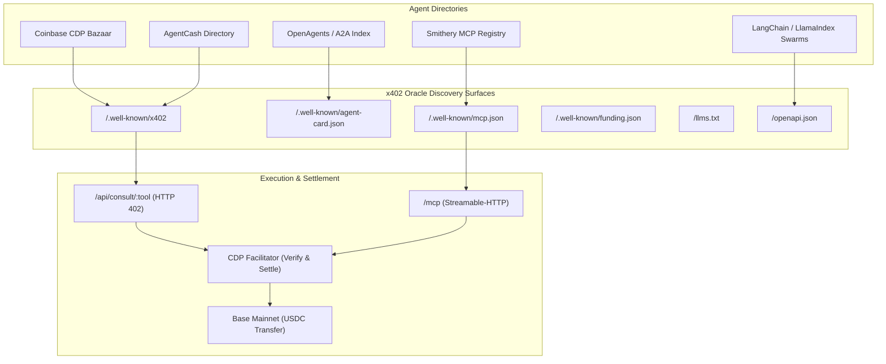

# x402 Oracle Multi-Registry Registration & Bazaar Strategy Guide

> **"402 is the answer. The Oracle is how you ask."**  
> Comprehensive technical guide for indexing, validating, and cataloging **x402 Oracle** (`x402orcle`) across decentralized agent directories, tool registries, and autonomous swarms.

---

## 1. Executive Summary & Architecture

x402 Oracle is a production-grade, decentralized wisdom market delivering autonomous blockchain diagnostics, MCP server validation, smart contract attestations, and Bazaar optimization.

- **Canonical URL:** `https://x402orcle.vercel.app`
- **Monorepo Repository:** `https://github.com/kwizzlesurp10-ctrl/x402orcle`
- **Settlement Network:** Base Mainnet (`eip155:8453`)
- **Settlement Asset:** Base USDC (`0x833589fCD6eDb6E08f4c7C32D4f71b54bdA02913`)
- **PayTo Settlement Address:** `0x05e1720bB82F86B5bc7940a99FDC702E32256357`
- **CDP Facilitator Endpoint:** `https://api.cdp.coinbase.com/platform/v2/x402`
- **CDP Validator Endpoint:** `https://api.cdp.coinbase.com/platform/v2/x402/validate`



---

## 2. Discovery Surfaces & Route Matrix

x402 Oracle exposes standardized, machine-readable discovery interfaces:

| Surface | Path | Content-Type | Protocol Target | Description |
| :--- | :--- | :--- | :--- | :--- |
| **Landing UI** | `/` | `text/html` | Human / Web Crawlers | Web UI with JSON-LD schema & connect guide |
| **x402 Catalog** | `/.well-known/x402` | `application/json` | x402 / AgentCash | Protocol v2 resource & payment requirements index |
| **Agent Card** | `/.well-known/agent-card.json` | `application/json` | OpenAgents / A2A | Google A2A protocol specification with payment rails |
| **A2A Federation** | `/.well-known/agents.json` | `application/json` | A2A Registry | Agent identity and settlement address index |
| **MCP Manifest** | `/.well-known/mcp.json` | `application/json` | Smithery / MCP | Streamable-HTTP tool schema and auth declarations |
| **Funding Cashier** | `/.well-known/funding.json` | `application/json` | Machine Cashier | Canonical payTo, network, and explorer links |
| **LLM Context** | `/llms.txt` | `text/plain` | LLM Agents | Plaintext system context and API invocation guide |
| **Agent Robots** | `/agents.txt` | `text/plain` | Autonomous Crawlers | Crawler permissions and payment headers |
| **OpenAPI 3.1** | `/openapi.json` | `application/json` | LangChain / LlamaIndex | OpenAPI schema annotated with `x-payment-info` |
| **Health Probe** | `/api/health` | `application/json` | Monitoring | Free seller status and facilitator health |
| **Rate Matrix** | `/api/pricing` | `application/json` | Swarm Quoting | Free active tool pricing and max price caps |

---

## 3. Tool Catalog & Pricing Matrix

All paid responses return the structured **Wisdom Envelope** (`verdict`, `wisdom`, `implementation_prompt`, `risk`, `citations`, `receipt`):

| Tool Name | Tier | Price (USD) | Atomic Units | Transport / Path | Description |
| :--- | :--- | :--- | :--- | :--- | :--- |
| `oracle_health` | Free | $0.00 | 0 | `GET /api/health` | Node status & facilitator verification |
| `oracle_pricing` | Free | $0.00 | 0 | `GET /api/pricing` | Active rate matrix & $25 fee ceiling |
| `oracle_ask` | Paid | $0.10 | 100,000 | `POST /api/consult/oracle_ask` | General protocol consultation & envelope |
| `oracle_diagnose_402` | Paid | $0.50 | 500,000 | `POST /api/consult/oracle_diagnose_402` | 402 header & facilitator debugging |
| `oracle_review_mcp` | Paid | $3.00 | 3,000,000 | `POST /api/consult/oracle_review_mcp` | MCP tool security & schema audit |
| `oracle_bazaar_rewrite` | Paid | $1.50 | 1,500,000 | `POST /api/consult/oracle_bazaar_rewrite` | Bazaar catalog SEO & tag rewriting |
| `complete_oracle_task` | Paid | $10.00 | 10,000,000 | `POST /api/consult/complete_oracle_task` | Blockchain attestation & custom task |

---

## 4. Coinbase CDP Bazaar Validation & Ranking Mechanics

### A. Preflight Validation Requirements (`/validate`)

Coinbase CDP provides an official automated preflight validation endpoint:  
`POST https://api.cdp.coinbase.com/platform/v2/x402/validate`

When submitted, CDP evaluates **25 distinct validation checks**:

1. **`url_valid`**: Target URL must be well-formed.
2. **`url_https`**: Must enforce TLS/HTTPS (`https://`).
3. **`endpoint_reachable`**: Endpoint responds to unpaid probe.
4. **`returns_402`**: Exact HTTP status 402 returned.
5. **`valid_json`**: Response body parses as valid JSON.
6. **`x402_version`**: Must declare `x402Version: 2`.
7. **`payment_required_header`**: Response must include base64-encoded `PAYMENT-REQUIRED` header.
8. **`has_accepts`**: At least 1 payment method in `accepts` array.
9. **`accepts[0].scheme`**: Scheme must be `"exact"` or `"upto"`.
10. **`accepts[0].network`**: Must be a supported network (`eip155:8453` Base mainnet).
11. **`accepts[0].asset`**: Must be official Base USDC (`0x833589fCD6eDb6E08f4c7C32D4f71b54bdA02913`).
12. **`accepts[0].amount`**: Amount must meet the minimum requirement (`>= 1000` atomic units / $0.001).
13. **`accepts[0].payTo`**: 42-character EVM address present.
14. **`accepts[0].maxTimeoutSeconds`**: Timeout duration specified.
15. **`has_resource`**: Resource block present with matching URL.
16. **`has_bazaar_extension`**: `extensions.bazaar` block present.
17. **`bazaar.info`**: Metadata info block present.
18. **`bazaar.info.input`**: Input payload specification declared.
19. **`bazaar.info.input.type`**: Declared as `"http"` or `"mcp"`.
20. **`bazaar.info.input.method`**: HTTP method declared (`"POST"`).
21. **`bazaar.info.input.method.matches_request`**: Probed method matches declared method.
22. **`bazaar.info.output`**: Output metadata present.
23. **`bazaar.info.output.example`**: Output example present.
24. **`bazaar.schema`**: Draft 2020-12 JSON schema present.
25. **`parse`**: Full Bazaar discovery extension parses successfully.

**Validation Command:**
```bash
curl -sS -X POST https://api.cdp.coinbase.com/platform/v2/x402/validate \
  -H 'Content-Type: application/json' \
  -d '{"resource":"https://x402orcle.vercel.app/api/consult/oracle_ask","method":"POST"}'
```

### B. The Mainnet Seed Settlement Requirement

> **CRITICAL RULE:** Unsettled endpoints with only 402 challenge probes remain **unranked** in Bazaar search results.

- **Ranking Trigger:** Bazaar's indexing engine monitors live on-chain settlements executed via `POST https://api.cdp.coinbase.com/platform/v2/x402/settle`.
- **Seed Action:** To activate search rank, the operator or buyer wallet must perform **1 real mainnet settlement transaction** (e.g. paying $0.10 USDC for `oracle_ask` on Base).
- **Settlement Execution:**
  ```bash
  # Using the Coinbase CLI (Buyer laptop with private key)
  coinbase x402 fetch \
    resource=https://x402orcle.vercel.app/api/consult/oracle_ask \
    input:='{"question":"Seed settlement verification for Bazaar indexing"}' \
    max_amount=100000
  ```
- Once settled, the transaction hash is verified on BaseScan, and the Bazaar daemon indexes the Oracle in primary ranking tiers.

---

## 5. AgentCash Directory Integration

AgentCash enables zero-config, pay-per-call agent payments across Base and Solana.

### CLI Integration Commands:
```bash
# 1. Discover all tools, pricing, and schemas:
npx agentcash@latest discover https://x402orcle.vercel.app

# 2. Add x402 Oracle as a persistent skill in local agent workspace:
npx agentcash@latest add https://x402orcle.vercel.app

# 3. Test a live consult call (auto-pays $0.10 USDC):
npx agentcash@latest fetch https://x402orcle.vercel.app/api/consult/oracle_ask \
  -m POST \
  -b '{"question":"Why is my Bazaar listing unranked?"}'
```

---

## 6. Smithery MCP Registry Integration

Smithery catalogs Model Context Protocol servers for Claude Desktop, Cursor, and autonomous agent clients.

- **MCP Transport:** `streamable-http`
- **MCP Endpoint:** `https://x402orcle.vercel.app/mcp`
- **Manifest:** `https://x402orcle.vercel.app/.well-known/mcp.json`
- **Root Config:** `smithery.json`

### Smithery Install Command:
```bash
npx @smithery/cli install @kwizzlesurp10-ctrl/x402orcle
```

---

## 7. OpenAgents / A2A Federation

x402 Oracle supports Google's Agent-to-Agent (A2A) protocol specification.

- **Agent Card URL:** `https://x402orcle.vercel.app/.well-known/agent-card.json`
- **Agents Index:** `https://x402orcle.vercel.app/.well-known/agents.json`
- **Capability Extensions:** `https://github.com/google-a2a/a2a-x402/v0.1`

Autonomous agent swarms discover x402 Oracle capabilities, payment rails, and skills list automatically during A2A handshake negotiation.

---

## 8. LangChain & LlamaIndex Swarm Integration

For multi-agent swarms using LangGraph, CrewAI, AutoGen, or LlamaIndex:

### Python Integration (`scripts/langchain_llamaindex_tools.py`)
```python
from langchain_llamaindex_tools import LangChainOracleAskTool, LlamaIndexOracleToolSpec

# LangChain / LangGraph Agent Integration:
oracle_tool = LangChainOracleAskTool()
response = oracle_tool.run("Analyze the security risks of an MCP server with shell execution")

# LlamaIndex Agent Integration:
spec = LlamaIndexOracleToolSpec()
tools = spec.to_tool_list()
```

### TypeScript Integration (`scripts/langchain_llamaindex_tools.ts`)
```typescript
import { X402OracleClient } from "./langchain_llamaindex_tools";

const client = new X402OracleClient("https://x402orcle.vercel.app");
const result = await client.consultTool("oracle_ask", {
  question: "How do I optimize Bazaar catalog metadata?"
});
```

---

## 9. Security & Key Isolation Policy

1. **Seller-Only Host:** The public host (Vercel) contains **NO SPEND PRIVATE KEYS** (`EVM_PRIVATE_KEY` is strictly forbidden in server env).
2. **CDP Authentication:** Settlement is authorized using read/facilitation credentials (`CDP_API_KEY_ID` and `CDP_API_KEY_SECRET`), ensuring wallet funds cannot be drained from server breaches.
3. **Price Clamping:** Server-side maximum price cap (`MAX_PRICE_USD=25`) prevents unvetted fee inflation.

---

## 10. Automated Validation Script

Run the automated verification suite anytime:
```bash
node /home/keef/x402orcle/scripts/validate_and_register.mjs
```
